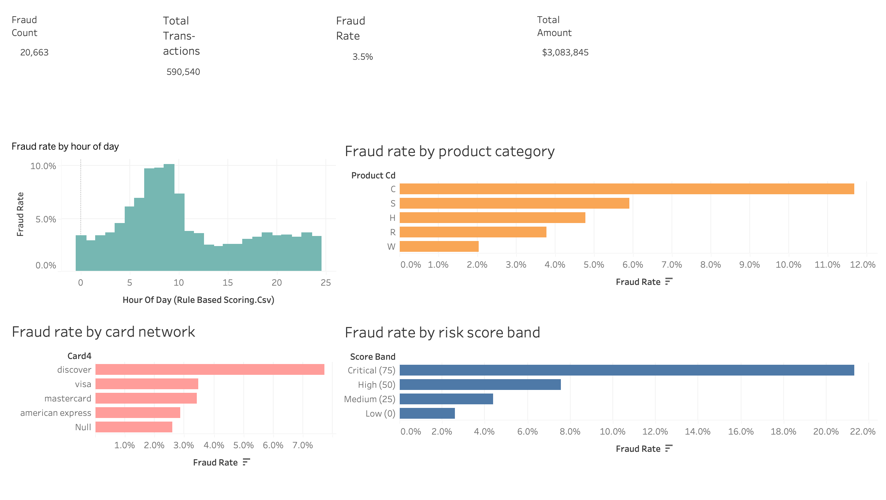
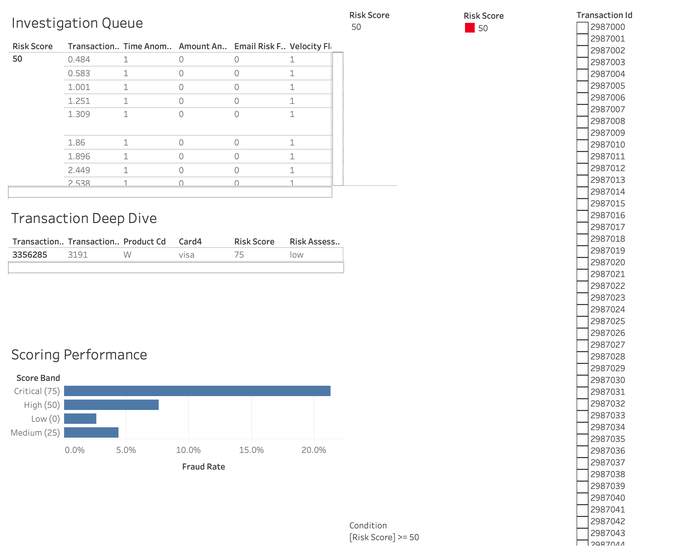

# Fraud Detection & Investigation Platform

An end-to-end fraud analytics pipeline built on the IEEE-CIS dataset. It combines a layered SQL data model, a rule-based risk scoring engine, and an LLM-powered investigation agent that generates structured case notes for flagged transactions — all surfaced in a Tableau dashboard.

---

## Architecture

```
Raw CSVs (IEEE-CIS)
    │
    ▼
[Staging]  stg_transactions + stg_identity
    │       Column normalisation, type casting, train/test split tagging
    ▼
[Intermediate]  int_transactions_enriched
    │            LEFT JOIN of transactions + identity (~26% of transactions have identity rows)
    │            Derived features: hour_of_day, card1 group average, email domain
    ▼
[Marts]  fct_fraud_analysis · agg_fraud_by_email_domain
    │     Train-split views shaped for Tableau
    ▼
[Scoring]  rule_based_scoring
    │       Four binary signals → 0–100 composite score applied across all splits
    ▼
[Agent]  batch_investigate.py
    │     Pulls top-N by risk score → builds customer context from DuckDB
    │     → LLM (Hermes 3 via OpenRouter) → structured JSON case note
    │     → writes InvestigationResult to case_notes table
    ▼
[Tableau]  Four-page dashboard reading from DuckDB
```

All layers live in a single DuckDB file (`data/duckdb/fraud.duckdb`). There is no external warehouse — the full 1.1M-row dataset fits comfortably in memory and the file-based database makes the repo self-contained for portfolio review.

---

## Key Findings

**Dataset**: 590k training transactions, 3.5% fraud rate. Only 26% of transactions have matching identity records, so the enrichment layer uses a LEFT JOIN.

**Scoring validation** — fraud rate climbs monotonically with score, confirming the rules carry real signal:

| Score | Fraud rate |
|-------|-----------|
| 0     | 2.6%      |
| 25    | 4.4%      |
| 50    | 7.6%      |
| 75    | 21.3%     |

No transactions hit 100 (all four flags firing simultaneously) in the dataset.

**Four fraud signals identified**:
- **Velocity** (`c1 > 3`): fraud rate doubles at this threshold (2.7% → 6.7%)
- **Amount anomaly** (`transaction_amt > 3× card1 group average`): normalised to the card's own baseline so high-spending legitimate customers aren't penalised
- **Time anomaly** (1 AM – 5 AM): the overnight window has materially elevated fraud prevalence
- **Email domain risk** (`mail.com` 19.0%, `outlook.es` 13.0%, `aim.com` 12.7% fraud rates in training data)

**Agent behaviour**: Across 20 score-75 transactions, the agent returned 9 high / 5 medium / 6 low risk assessments with a spread of approve, decline, escalate, and hold actions — it's reading context, not rubber-stamping the rules engine. The free-tier model shows inconsistency on edge cases (two confirmed-fraud transactions were assessed as low risk), which is expected: the agent is a triage aid for human analysts, not an automated decision-maker.

---

## Tech Stack

| Tool | Role | Why |
|------|------|-----|
| **DuckDB** | Analytics database | Columnar, in-process, no server to manage. Handles 1.1M rows trivially; the `.duckdb` file is portable. |
| **SQL (medallion layers)** | Data transformation | Staging → intermediate → marts → scoring keeps raw data untouched and each layer independently queryable and auditable. |
| **Python + uv** | Orchestration & agent | `uv` for fast, reproducible dependency management. Python glues DuckDB reads to LLM calls and writes results back. |
| **OpenAI SDK → OpenRouter** | LLM calls | Provider-agnostic wrapper: changing three constants (`BASE_URL`, `MODEL`, `API_KEY_ENV`) swaps the provider entirely. Free-tier Hermes 3 for development; Claude Haiku 4.5 for showcase quality. |
| **Tableau Public** | Dashboard | Four-page layout covering executive overview, investigation queue, transaction deep-dive with AI case notes, and scoring performance validation. |

---

## Setup

**Prerequisites**: Python 3.9+, `uv`, and the raw IEEE-CIS CSVs placed in `data/raw/`.

```bash
# 1. Install dependencies
uv sync

# 2. Add credentials
cp .env.example .env
# Set OPENROUTER_API_KEY in .env

# 3. Load raw CSVs into DuckDB staging tables
uv run python/load_data.py

# 4. Build intermediate, mart, and scoring layers
uv run python/run_sql.py

# 5. Smoke-test the agent on a single transaction
uv run python -m python.agent.investigate

# 6. Run batch investigation on the top 20 transactions by risk score
uv run python -m python.agent.batch_investigate --limit 20
```

The database is written to `data/duckdb/fraud.duckdb`. Connect Tableau to it via the DuckDB JDBC driver, or export to Parquet for Tableau Cloud.

---

## Dashboard

Built in Tableau Desktop. Four pages, all reading from `data/duckdb/fraud.duckdb`.

### Executive Overview
20,663 fraud cases across 590,540 transactions ($3,083,845 total). Key breakdowns: fraud peaks between hours 5–10 (morning spike, not overnight as the scoring rule assumes — a refinement opportunity), product category C has the highest fraud rate at ~12%, and Discover cards are disproportionately represented at ~7%.



### Investigation Queue · Transaction Deep-Dive · Scoring Performance
The investigation queue filters by risk score (shown here at threshold ≥ 50) and surfaces all four rule flags per transaction. The scoring performance chart confirms monotonicity: Critical (75) at ~21%, High (50) at ~8%, Medium (25) at ~4%, Low (0) at ~2.5%.



---

## What I'd Do Next

- **Swap to Claude Haiku 4.5** and document the delta: JSON schema compliance, reasoning quality, and consistency vs. Hermes 3 on the same 20 transactions. The architecture already supports it — three constant changes in `llm_client.py`.
- **Add an ML scoring layer**: logistic regression or gradient boosting on the enriched features as a complement to the rule engine. The rules are interpretable; a model would capture feature interactions the rules miss.
- **Expand agent context**: the current prompt supplies 30-day history and similar-pattern transactions. Adding device fingerprint history and cross-card linkage would materially improve pattern detection for account-takeover fraud.
- **Automate the pipeline**: a cron job or lightweight DAG to ingest new transactions, score them, and queue the top-N for agent investigation on a daily cadence.
- **Harden the agent's JSON extraction**: parametrised unit tests for `extract_json()` covering truncated JSON, nested markdown fences, and partial objects — the current retry logic works but is untested on edge cases.
